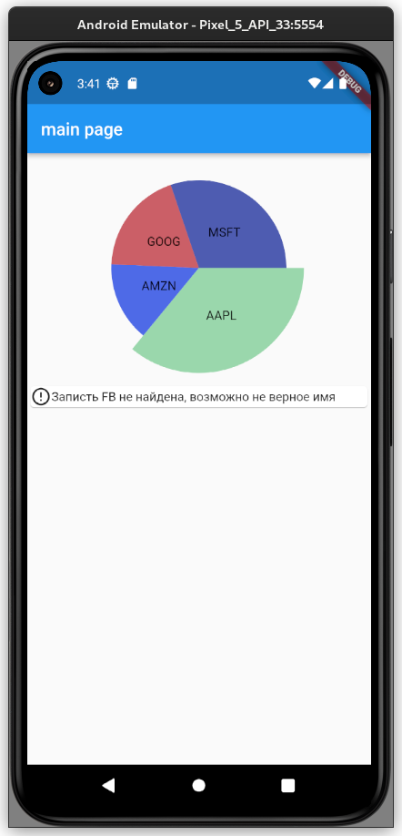

# Stocks overview

Flutter project that uses public api to retrieve stocks info

## Stack

Highlight packages:

- dio — api fetching
- flutter_riverpod — DI, app-level state management
- flutter_hooks — widget level state management
- freezed — common model methods codegenerator

Code:

- aimed to follow clean architecture
- feature first approach
- reactive UI

Highlights:

- errors are handled
- Loading is lazy
- testing is easy because of DI

## Developers

If changing any model, run build runner.
`flutter pub run build_runner build --delete-conflicting-outputs`
or `just codegen-watch` for `just` users.

Then standart procedure to run flutter project.
`flutter run`

## Gallery

